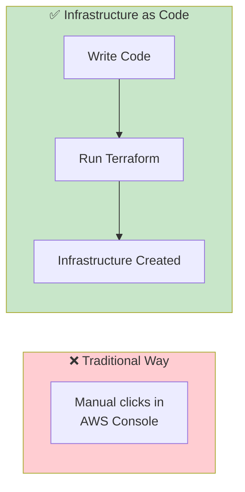
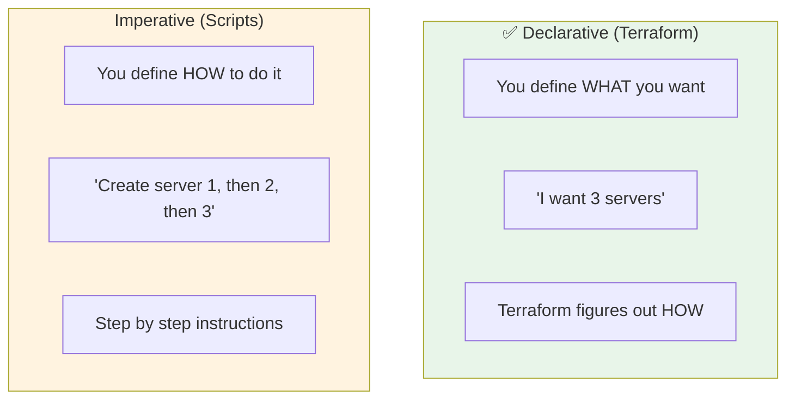
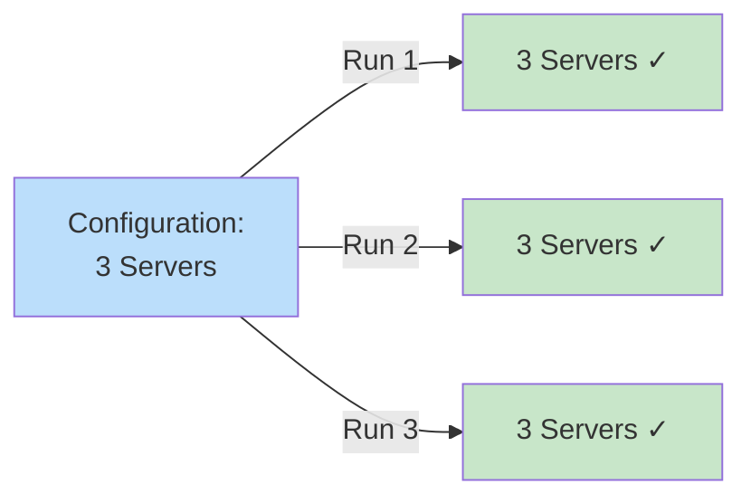
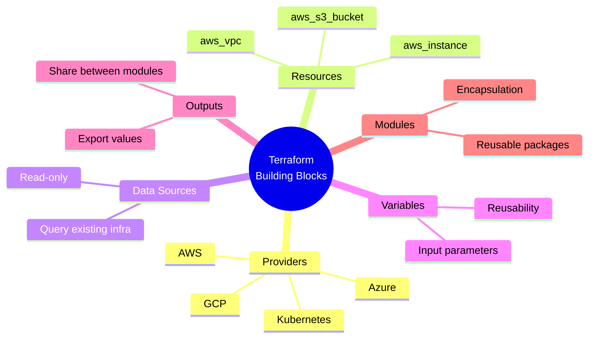
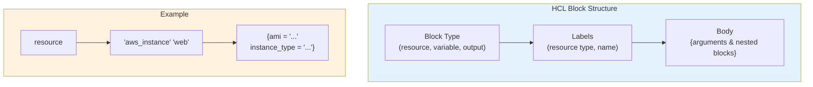
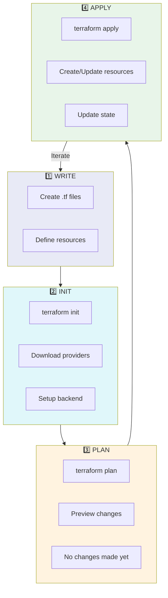
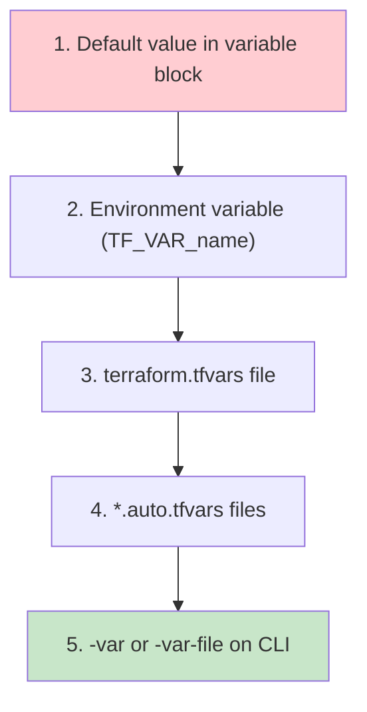

# Terraform Basic Concepts

> Understanding the fundamentals of Terraform

---

## What is Terraform?

Terraform is an **Infrastructure as Code (IaC)** tool that lets you define and manage infrastructure using declarative configuration files.



---

## Key Concepts

### 1. Declarative vs Imperative



### 2. Idempotency

Running the same Terraform configuration multiple times produces the **same result**.



---

## Core Building Blocks



---

## HCL - HashiCorp Configuration Language

Terraform uses **HCL** (HashiCorp Configuration Language) for configuration files.

### Basic Syntax

```hcl
# This is a comment

# Block type with labels
resource "aws_instance" "web_server" {
  # Arguments
  ami           = "ami-12345678"
  instance_type = "t3.micro"
  
  # Nested block
  tags = {
    Name = "WebServer"
  }
}
```

### Block Structure



---

## Terraform File Types

| Extension | Purpose |
|-----------|---------|
| `.tf` | Main configuration files (HCL) |
| `.tfvars` | Variable values |
| `.tfstate` | State file (JSON) |
| `.tfplan` | Saved execution plan |

### Recommended File Organization

```
project/
├── main.tf          # Main resources
├── variables.tf     # Input variable declarations
├── outputs.tf       # Output declarations
├── providers.tf     # Provider configuration
├── versions.tf      # Terraform & provider versions
├── terraform.tfvars # Variable values (don't commit secrets!)
└── README.md        # Documentation
```

---

## The Terraform Workflow



---

## Variables

### Declaring Variables

```hcl
variable "instance_type" {
  description = "EC2 instance type"
  type        = string
  default     = "t3.micro"
}

variable "instance_count" {
  description = "Number of instances"
  type        = number
  default     = 1
}

variable "enable_monitoring" {
  description = "Enable detailed monitoring"
  type        = bool
  default     = false
}
```

### Using Variables

```hcl
resource "aws_instance" "web" {
  instance_type = var.instance_type
  count         = var.instance_count
  monitoring    = var.enable_monitoring
}
```

### Variable Precedence (Lowest to Highest)



---

## Outputs

Outputs expose values from your configuration.

```hcl
output "instance_public_ip" {
  description = "Public IP of the EC2 instance"
  value       = aws_instance.web.public_ip
}

output "instance_id" {
  description = "ID of the EC2 instance"
  value       = aws_instance.web.id
}
```

**Use cases:**
- Display information after `terraform apply`
- Pass data between modules
- Query with `terraform output`

---

## Next Steps

Continue to:
1. [Provider Architecture](./02-provider-architecture.md) - How providers work
2. [Terraform Architecture](./03-terraform-architecture.md) - Internal architecture
