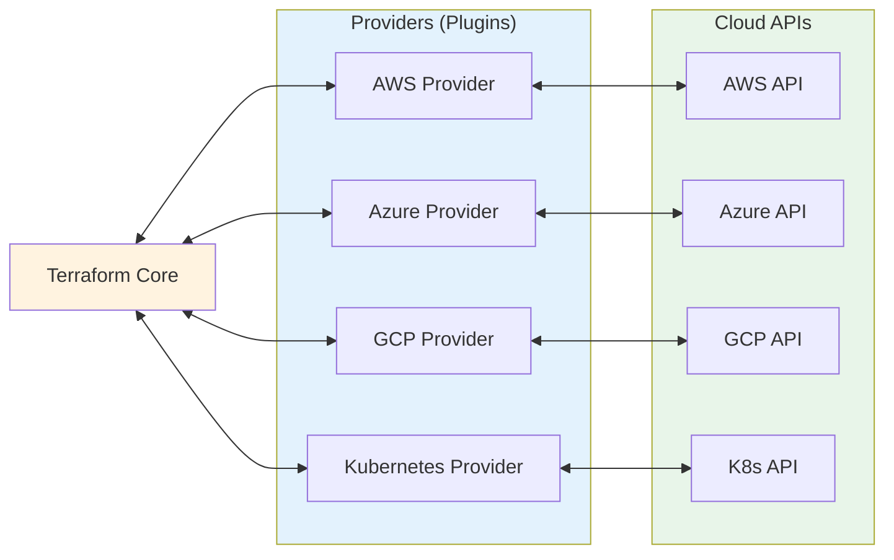
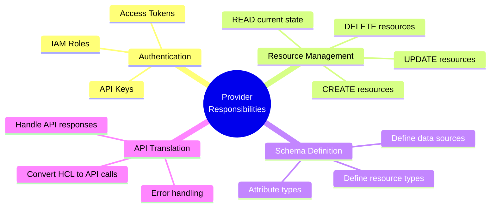
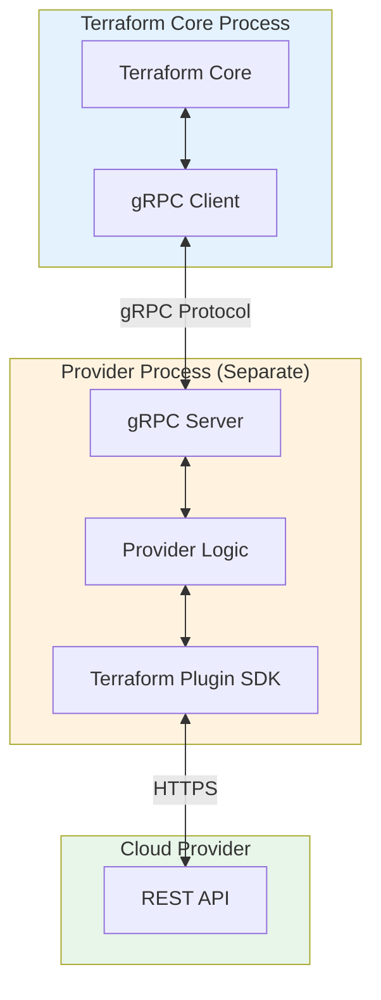
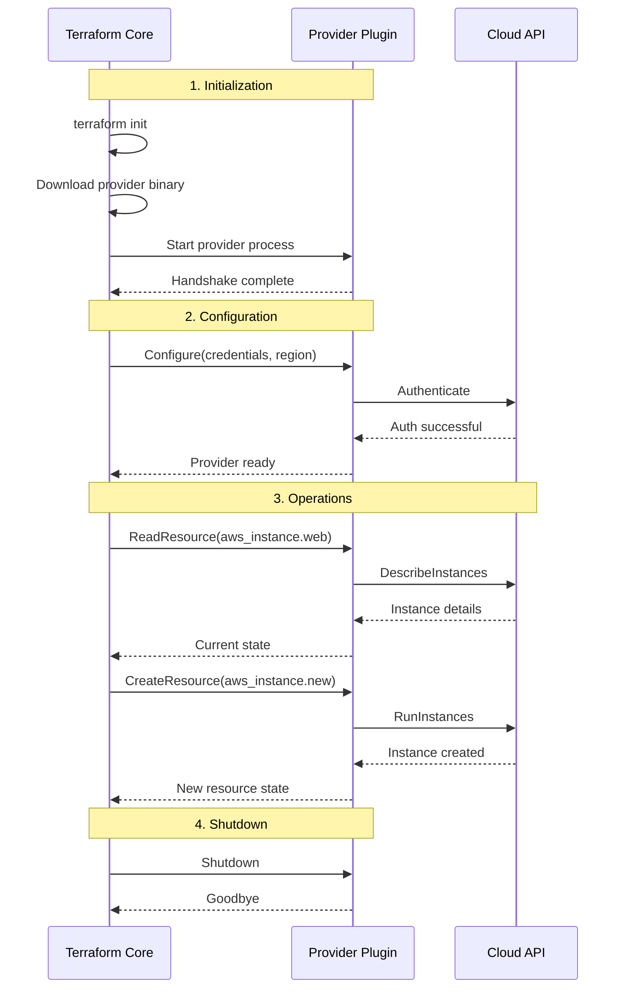
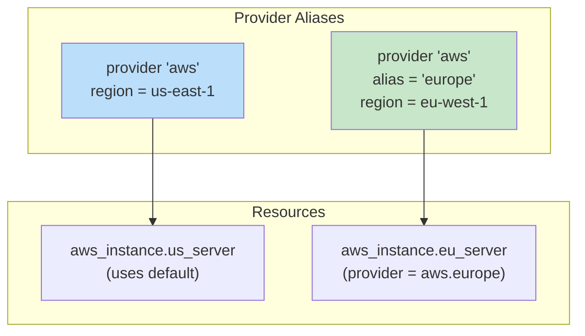
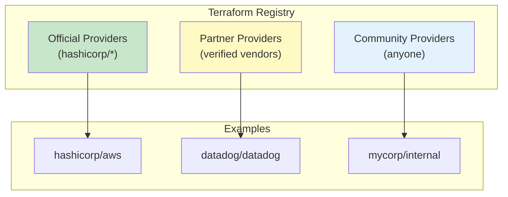
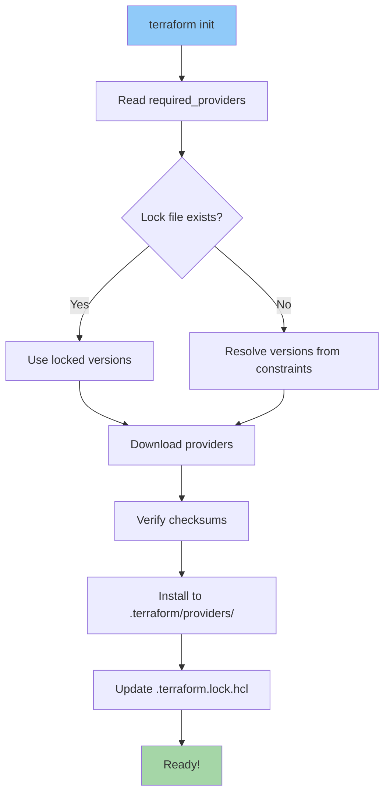
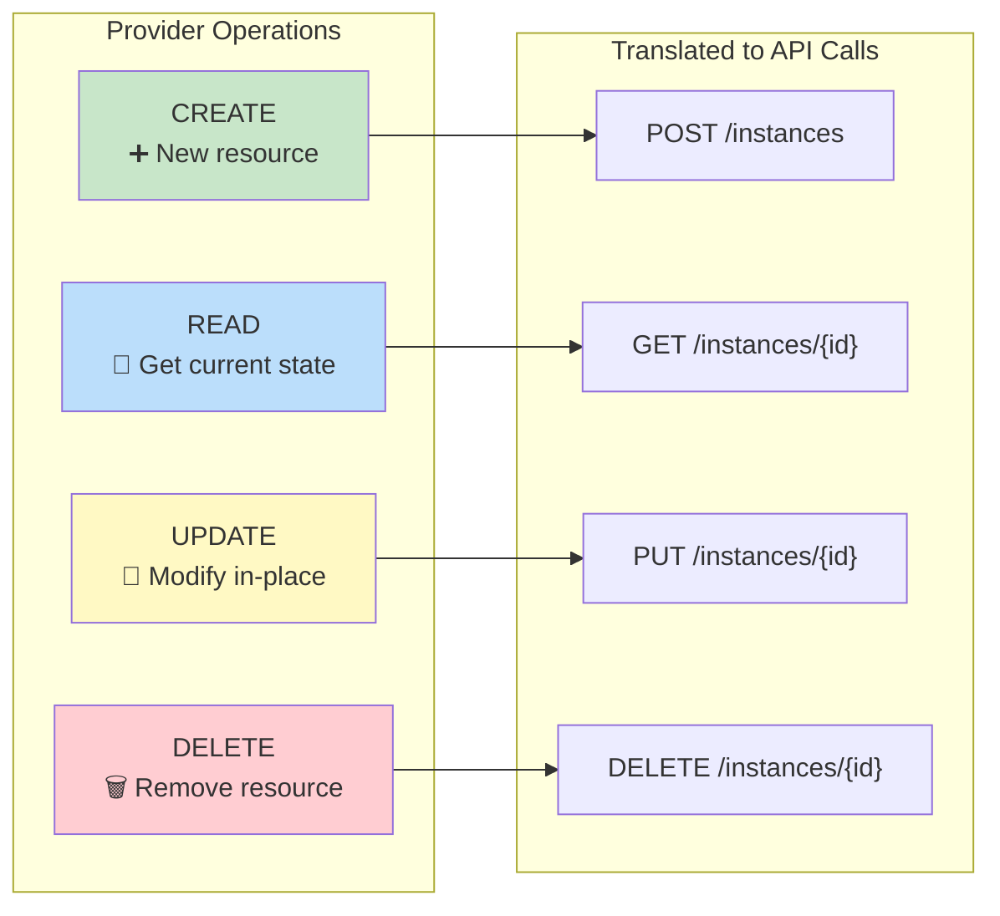

# Terraform Provider Architecture

> Understanding how Providers work in Terraform

---

## What is a Provider?

A **Provider** is a plugin that enables Terraform to interact with cloud platforms, SaaS providers, and other APIs.



---

## Provider Responsibilities



---

## How Providers Work

### Plugin Architecture

Providers run as **separate processes** and communicate with Terraform Core via **gRPC**.



### Provider Lifecycle



---

## Configuring Providers

### Basic Configuration

```hcl
# providers.tf

terraform {
  required_providers {
    aws = {
      source  = "hashicorp/aws"
      version = "~> 5.0"
    }
  }
}

provider "aws" {
  region = "us-east-1"
}
```

### Provider with Authentication

```hcl
# Option 1: Explicit credentials (NOT recommended for production)
provider "aws" {
  region     = "us-east-1"
  access_key = "AKIA..."
  secret_key = "..."
}

# Option 2: Environment variables (Recommended)
# Export these before running terraform:
# export AWS_ACCESS_KEY_ID="AKIA..."
# export AWS_SECRET_ACCESS_KEY="..."
provider "aws" {
  region = "us-east-1"
}

# Option 3: AWS Profile
provider "aws" {
  region  = "us-east-1"
  profile = "my-profile"
}

# Option 4: IAM Role (Best for EC2/ECS)
provider "aws" {
  region = "us-east-1"
  # Uses instance profile automatically
}
```

### Multiple Provider Configurations (Aliases)

```hcl
# Default provider (us-east-1)
provider "aws" {
  region = "us-east-1"
}

# Aliased provider (eu-west-1)
provider "aws" {
  alias  = "europe"
  region = "eu-west-1"
}

# Using the default provider
resource "aws_instance" "us_server" {
  ami           = "ami-12345"
  instance_type = "t3.micro"
}

# Using the aliased provider
resource "aws_instance" "eu_server" {
  provider      = aws.europe
  ami           = "ami-67890"
  instance_type = "t3.micro"
}
```



---

## Provider Version Constraints

```hcl
terraform {
  required_providers {
    aws = {
      source  = "hashicorp/aws"
      version = "~> 5.0"      # >= 5.0.0 and < 6.0.0
    }
    
    random = {
      source  = "hashicorp/random"
      version = ">= 3.0, < 4.0"
    }
    
    kubernetes = {
      source  = "hashicorp/kubernetes"
      version = "2.23.0"       # Exact version
    }
  }
}
```

### Version Constraint Operators

| Operator | Meaning | Example |
|----------|---------|---------|
| `=` or none | Exact version | `= 5.0.0` |
| `!=` | Not equal | `!= 5.0.0` |
| `>`, `>=`, `<`, `<=` | Comparison | `>= 5.0.0` |
| `~>` | Pessimistic (allow rightmost increment) | `~> 5.0` allows `5.x` |

---

## Provider Registry

Providers are distributed through the **Terraform Registry**.



### Provider Source Address Format

```
[hostname/]namespace/name

Examples:
- hashicorp/aws              → registry.terraform.io/hashicorp/aws
- datadog/datadog            → registry.terraform.io/datadog/datadog
- mycorp.com/internal/myapp  → mycorp.com/internal/myapp
```

---

## What Happens During `terraform init`



### Directory Structure After Init

```
project/
├── .terraform/
│   └── providers/
│       └── registry.terraform.io/
│           └── hashicorp/
│               └── aws/
│                   └── 5.31.0/
│                       └── darwin_arm64/
│                           └── terraform-provider-aws_v5.31.0
└── .terraform.lock.hcl    # Dependency lock file
```

---

## Provider CRUD Operations

Providers implement **CRUD** (Create, Read, Update, Delete) operations for each resource type.



---

## Popular Providers

| Provider | Source | Use Case |
|----------|--------|----------|
| AWS | `hashicorp/aws` | Amazon Web Services |
| Azure | `hashicorp/azurerm` | Microsoft Azure |
| Google | `hashicorp/google` | Google Cloud Platform |
| Kubernetes | `hashicorp/kubernetes` | K8s cluster management |
| Helm | `hashicorp/helm` | Helm chart deployment |
| Docker | `kreuzwerker/docker` | Docker containers |
| GitHub | `integrations/github` | GitHub resources |
| Datadog | `datadog/datadog` | Monitoring |

---

## Next Steps

Continue to:
1. [Terraform Architecture](./03-terraform-architecture.md) - Complete internal architecture
