# Terraform Internal Architecture

> Deep dive into how Terraform works under the hood

---

## High-Level Architecture

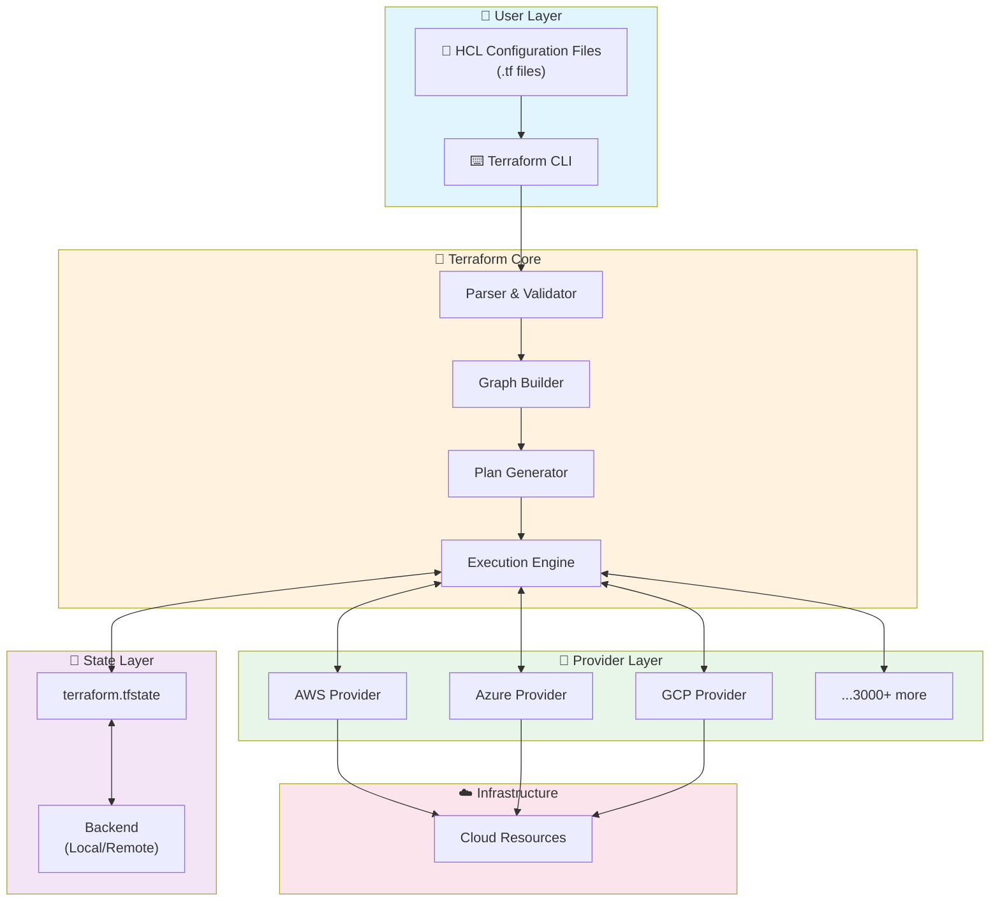

---

## Terraform Core Components

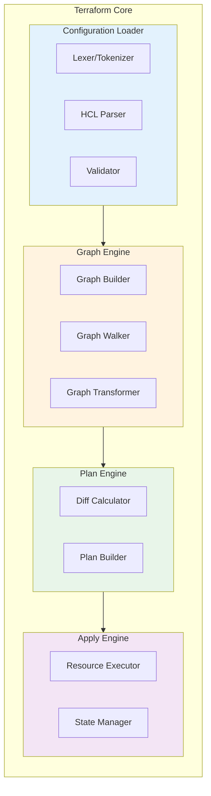

---

## Configuration Processing

### How Terraform Reads Your Code

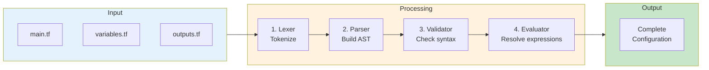

---

## Dependency Graph (DAG)

Terraform builds a **Directed Acyclic Graph** to determine resource order.

### Example Infrastructure Graph

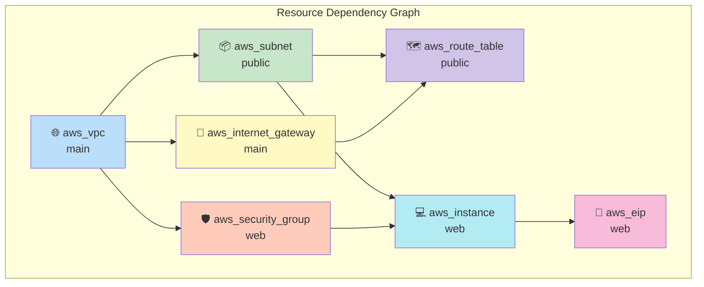

### Parallel Execution

Resources without dependencies can be created **in parallel**.

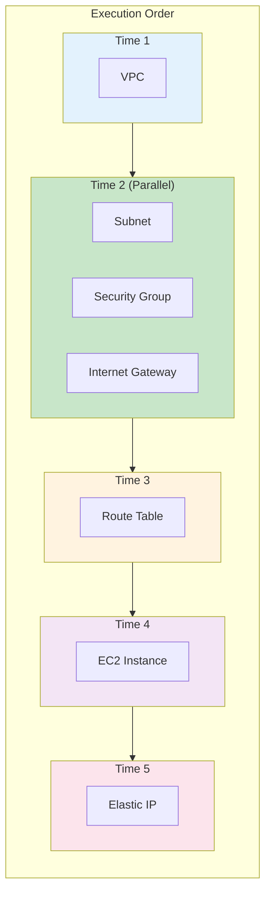

### Implicit vs Explicit Dependencies

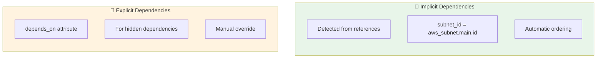

```hcl
# Implicit dependency - Terraform detects automatically
resource "aws_instance" "web" {
  subnet_id = aws_subnet.public.id  # ← Creates dependency
}

# Explicit dependency - You specify manually
resource "aws_instance" "app" {
  depends_on = [aws_iam_role_policy.s3_access]  # ← Hidden dependency
}
```

---

## Execution Plan

### Plan Generation Process

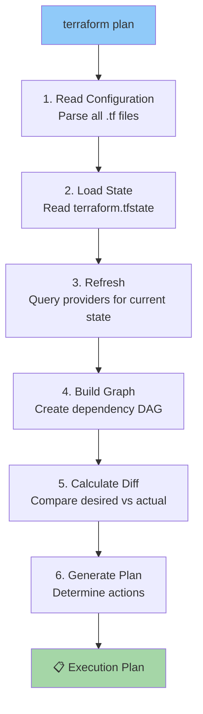

### Plan Actions

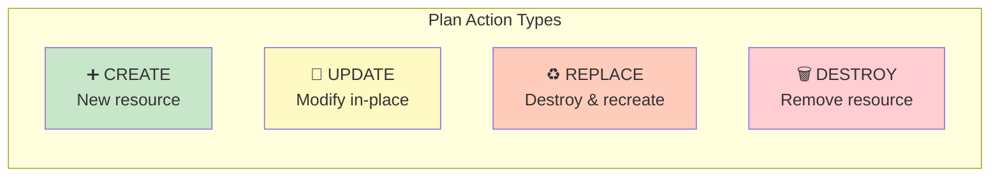

---

## How `terraform apply` Works

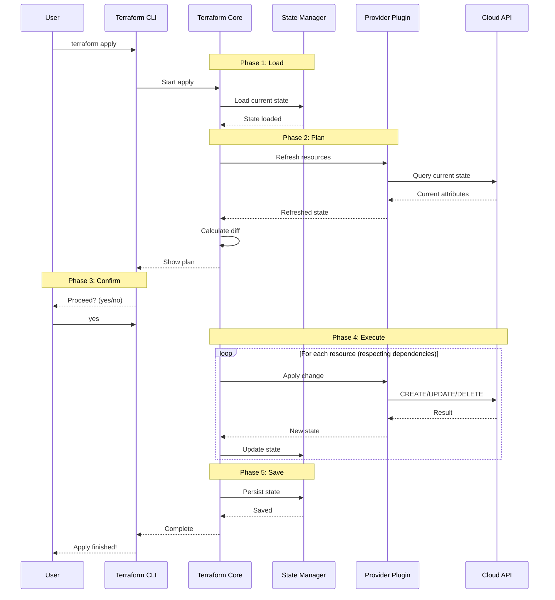

---

## Graph Walking Algorithm

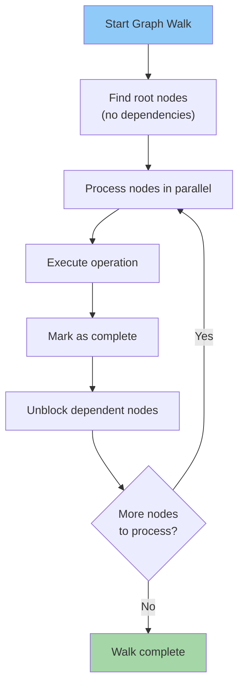

---

## Terraform Commands Flow

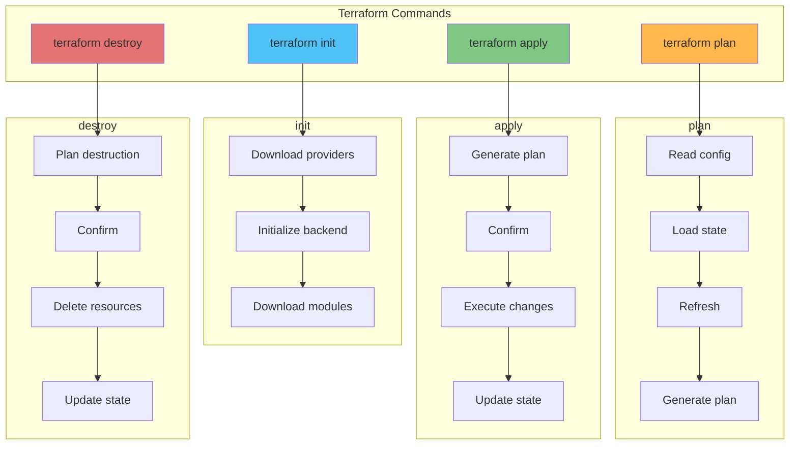

---

## Summary

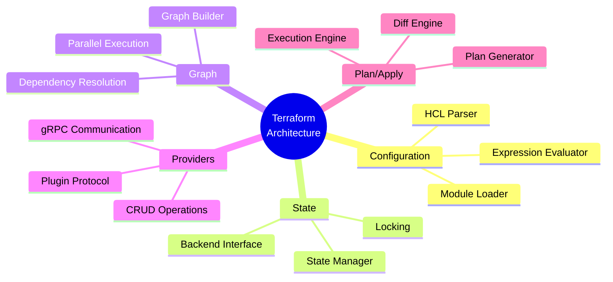

---

## Key Takeaways

1. **Declarative**: You define the desired state, Terraform figures out how
2. **Graph-Based**: Dependencies enable parallel execution
3. **Provider Plugins**: Separate processes communicate via gRPC
4. **State-Driven**: State tracks what Terraform manages
5. **Idempotent**: Same config = same result
