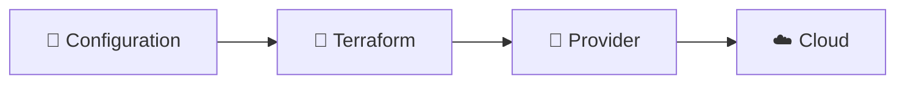

# Terraform Architecture & Concepts

> Mermaid diagrams and documentation explaining how Terraform works

---

## 📚 Contents

| Document | Description |
|----------|-------------|
| [01-terraform-basics.md](./01-terraform-basics.md) | Basic Terraform concepts, HCL syntax, workflow |
| [02-provider-architecture.md](./02-provider-architecture.md) | How providers work, configuration, authentication |
| [03-terraform-architecture.md](./03-terraform-architecture.md) | Internal architecture, graphs, execution engine |

---

## 🎯 Learning Path

```
┌─────────────────────────────────────────────────────────┐
│                     START HERE                          │
│              01-terraform-basics.md                     │
│        • What is Terraform?                             │
│        • Declarative vs Imperative                      │
│        • HCL Syntax                                     │
│        • Variables & Outputs                            │
└─────────────────────────┬───────────────────────────────┘
                          │
                          ▼
┌─────────────────────────────────────────────────────────┐
│             02-provider-architecture.md                  │
│        • What are Providers?                            │
│        • Provider Configuration                         │
│        • Authentication Methods                         │
│        • Provider Aliases                               │
└─────────────────────────┬───────────────────────────────┘
                          │
                          ▼
┌─────────────────────────────────────────────────────────┐
│             03-terraform-architecture.md                 │
│        • Internal Components                            │
│        • Dependency Graphs                              │
│        • How terraform apply works                      │
│        • Parallel Execution                             │
└─────────────────────────────────────────────────────────┘
```

---

## 📊 Viewing Mermaid Diagrams

These documents contain **Mermaid diagrams** for visualizing concepts.

### How to View

| Platform | Instructions |
|----------|--------------|
| **GitHub** | Diagrams render automatically |
| **VS Code** | Install "Markdown Preview Mermaid Support" extension |
| **Web** | Paste diagrams at [mermaid.live](https://mermaid.live) |

### Example Diagram



---

## 📝 Quick Reference

### Terraform Workflow

```
Write (.tf files) → Init → Plan → Apply
```

### Key Components

| Component | Purpose |
|-----------|---------|
| **Provider** | Plugin to interact with APIs |
| **Resource** | Infrastructure object to manage |
| **Data Source** | Query existing infrastructure |
| **State** | Tracks what Terraform manages |
| **Module** | Reusable group of resources |
